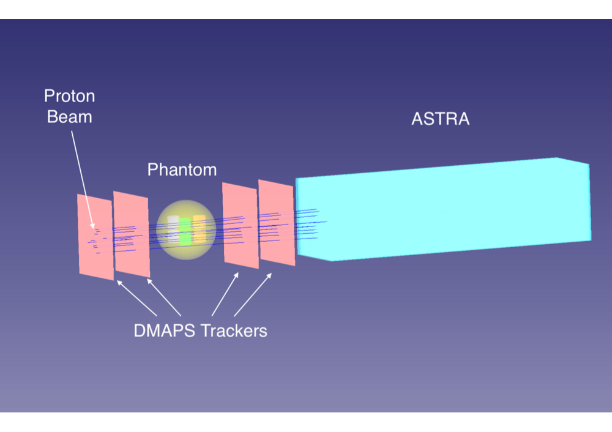
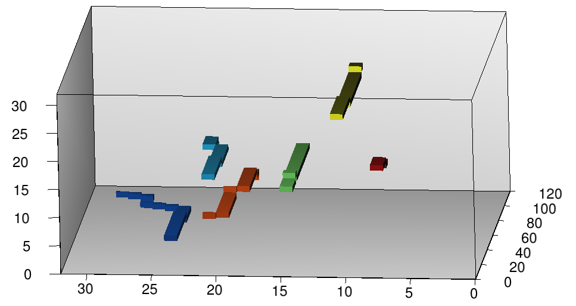
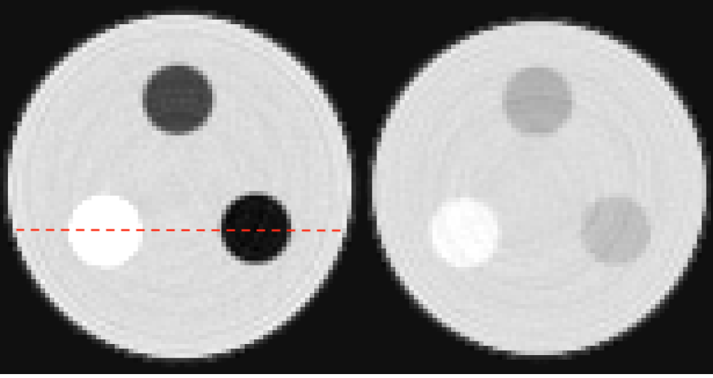
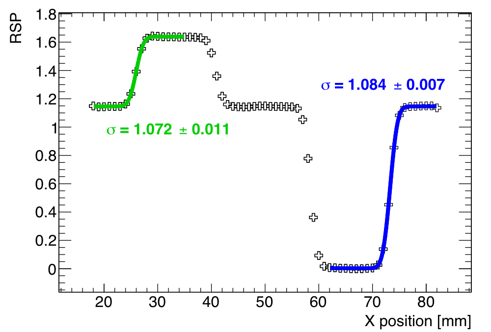

# ASTRA

<h3 align="center"><b>A</b> <b>S</b>uper <b>T</b>hin pl<b>A</b>stic <b>RA</b>nge telescope</h3>

<p align="center">
  <i>A novel plastic-scintillator-based range telescope concept for proton computed tomography (pCT)</i>
</p>

---

## Overview

ASTRA is a GEANT4-based Monte Carlo simulation toolkit for evaluating the performance of a range telescope made of orthogonal thin bars of plastic scintillator for proton CT imaging.


*3D visualization of the pCT system showing the proton beam, four DMAPS tracker planes, a spherical phantom with cylindrical inserts, and the ASTRA range telescope. Multiple protons (dark blue lines) are tracked simultaneously.*

### Key Performance

| Metric | Value |
|--------|-------|
| Energy resolution (by range) | ~0.7% |
| Energy resolution (with calorimetry) | ~0.5% |
| Data collection rate | 10<sup>8</sup> protons/s (100 MHz) |
| Spatial resolution | ~1.1 mm |
| RSP accuracy | < 0.5% |

---

## Publication

This code was developed for the following publication:

> M. Granado-González, C. Jesús-Valls, T. Lux, T. Price, F. Sánchez,
> **"A novel range telescope concept for proton CT"**,
> *Phys. Med. Biol.* **67** (2022) 035013
>
> DOI: [10.1088/1361-6560/ac4b39](https://doi.org/10.1088/1361-6560/ac4b39) | arXiv: [2109.03452](https://arxiv.org/abs/2109.03452)

**If you use this code, please cite the above publication.**

---

## System Components

### 1. DMAPS Position Tracker
Four Depleted Monolithic Active Pixel Sensors arranged in pairs on either side of the phantom:
- **Thickness**: 100 μm silicon
- **Pixel size**: 40×40 μm²
- **Coverage**: 10×10 cm²
- **Frame rate**: 40 MHz

### 2. ASTRA Range Telescope
Plastic scintillator bars (EJ-200) arranged in alternating orthogonal layers:
- **Bar dimensions**: 3×3×96 mm³
- **Layers**: 120 (360 mm total depth, stops protons up to 240 MeV)
- **Readout**: SiPMs directly coupled to scintillator
- **Scintillation**: 0.9 ns rise time, 2.1 ns decay time

### 3. Phantom
Configurable test objects for imaging studies, including spherical phantoms with cylindrical inserts of various tissue-equivalent materials.

---

## Event Reconstruction

### 2D Event Display

The simulation produces detailed 2D event displays showing proton energy deposits in ASTRA:


*Top and side views of multiple proton tracks in ASTRA. The color scale indicates energy deposit (MeV), with the characteristic Bragg peak visible at the end of each track where protons stop and deposit maximum energy.*

### 3D Multi-Proton Tracking

ASTRA's bar-based geometry enables simultaneous tracking of multiple protons:


*3D reconstruction of six simultaneous protons in ASTRA. Each color represents a different reconstructed track. The orthogonal bar arrangement allows unambiguous 3D position reconstruction even when multiple protons traverse the detector simultaneously.*

---

## Imaging Results

### Proton CT Reconstruction

The system produces high-quality 3D RSP (Relative Stopping Power) maps:


*Two slices from a pCT reconstruction of a 75 mm diameter Perspex phantom with six cylindrical tissue-equivalent inserts. Left slice: hard cortical bone (bright), lung (dark), air (black). Right slice: rib bone, water, adipose tissue. RSP values are reconstructed with < 0.5% accuracy.*

### Spatial Resolution


*RSP profile along the red dashed line in the pCT image. The transition regions between materials are characterized by error function fits, yielding a spatial resolution of σ ≈ 1.1 mm.*

---

## Requirements

- [GEANT4](https://geant4.web.cern.ch/) (tested with v4.10.05)
- [ROOT](https://root.cern/) (for analysis and visualization)
- CMake (≥ 3.0)
- C++11 compatible compiler

## Installation

```bash
git clone https://github.com/cesarjesusvalls/ASTRA.git
cd ASTRA
mkdir build && cd build
cmake ../
make
```

**Post-installation:**
```bash
# Move dictionary file
cp build/src/*.pcm lib/

# Create output directories
mkdir -p output plots
```

---

## Usage

### Quick Start

```bash
cd scripts

# Run energy resolution study
python make_res_prod.py    # GEANT4 simulation
python make_res_ana.py     # Analysis

# Generate plots
cd ../bin
./plot_energy_res
```

### Phantom Imaging

```bash
cd scripts
python make_imag_prod.py   # GEANT4 simulation
python make_imag_ana.py    # Analysis
cd ../bin
./plot_phantom_image
```

### Configuration

Edit XML files in `/config` to modify:
- Beam settings (energy, profile, position)
- Detector geometry (bar size, number of layers)
- Phantom properties (materials, dimensions)
- Number of simultaneous protons (`Nprotons`)

---

## Repository Structure

```
ASTRA/
├── analysis/        # Analysis source code
├── cmake/           # CMake configuration for ROOT
├── config/          # XML configuration files
├── docs/            # Documentation and figures
├── include/         # Header files
├── mac/             # GEANT4 macro files
├── plotters/        # ROOT plotting scripts
├── scripts/         # Python automation scripts
├── src/             # Source code
│   ├── CMOS/        # DMAPS tracker geometry
│   ├── SciDet/      # ASTRA detector geometry
│   └── phantom/     # Phantom definitions
├── utils/           # Utility functions
└── pCTsimulation.cc # Main simulation entry point
```

---

## Authors

- **Marc Granado-González** — University of Birmingham
- **César Jesús-Valls** — IFAE Barcelona
- **Thorsten Lux** — IFAE Barcelona
- **Tony Price** — University of Birmingham
- **Federico Sánchez** — University of Geneva

## Acknowledgments

This work was supported by:
- Spanish Ministerio de Economía y Competitividad (SEIDI-MINECO) — Grants PID2019-107564GB-I00, SEV-2016-0588
- CERCA program of the Generalitat de Catalunya
- Swiss National Foundation — Grant 200021_85012
- EPSRC — Grant EP/R023220/1

